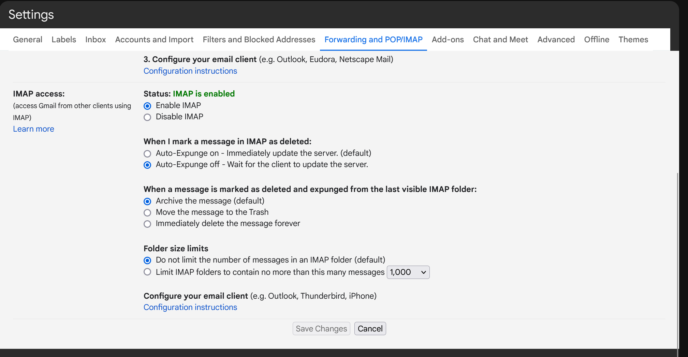

# AI Email Scrubber
Let's face it. The late stage capitalism phase of Google is pretty much pure dogshit. Nearly everything that
hits my inbox is some form of junk, spam, or marketing. 

Let's have an LLM take care of this for us.

# Prerequisites

### Hardware

You need access to some kind of hardware acceleration to have an open source LLM get through your inbox in a reasonable amount of time. To be honest, any Apple M{1-3} machine with a decent bit of shared RAM should do the trick. M1s aren't crazy fast
but will absolutely work. M3s are probably amazing, but I haven't personally used one.

If you have an NVIDIA 30xx or 40xx with at least 8GB of VRAM (ideally 12GB), this is better. You may need to install CUDA drivers and such. Refer to Ollama docs to verify if your LLM is in fact running on GPU.

You could also just run it in AWS, but then you have to spend money, and if you're going to spend money, then maybe ChatGPT is a better chocie. I don't know.


### Setting up Ollama
Just go and download Ollama here. https://ollama.com/
Once you've got it running, my suggestion is to use Llama3.1. You can test it with `ollama run llama3.1`. 

In the background Ollama runs a server by default on `localhost:11434`


### Setting up an application password with gmail

1) Go into your gmail settings and turn on IMAP.
    You should be able to find it if you're logged into your gmail account at the following URL: https://mail.google.com/mail/u/0/#settings/fwdandpop
    

2) Create yourself an application password for IMAP clients. 
   * Go here : https://myaccount.google.com/apppasswords
   * It doens't matter what you name your app password

### Setting up a Python Environment

I highly suggest simply installing Anaconda, which can be downloaded here: 
https://www.anaconda.com/download/success

You could also just use whatever environment you want. As long as it's Python 3.9 or newer, I doubt there will be much of a difference.

After you've set up your environment, we have two minor dependencies to add, which are listed in the `requirements.txt`

If you have your `conda` environment or system Python activated, just run:
`pip install -r requirements.txt`

# Running the program

Run this:
```bash
python email_llm.py
```
You'll be prompted to enter your gmail address, and then the app password you generated. There is almost zero error handling, so if something breaks, ping me. 
Sorry, I wrote it in an afternoon on labor day... with screaming children. 

### Important things to note

In the directory of the project, the program will create a `email_files/` sub-directory. Each email that is successfully processed will end up written out as a `.eml` file in this directory. 
You can and *should* archive it. 

Why? Because the LLM definitely isn't perfect. There will be things that it fails to delete that are obviously spam, as well as useful things that are deleted and should have been kept.

Second, all of the data is going to be stored in very convenient non-nested key-value structure in this `pickledb` file which the program will name
`data.db`

This `data.db` file will be used to cache results, just in case the program dies or freezes. 

The execution flow of the program goes in phases. First the LLM classifies every email, and the results are stored in the `data.db` cache.
Once that finishes, the email IDs marked for deletion are collected and a single instruction is issued over IMAP to delete them.

Definitely customize the prompt sent to the LLM to your liking as well.

Hope you enjoy it / find it useful.
